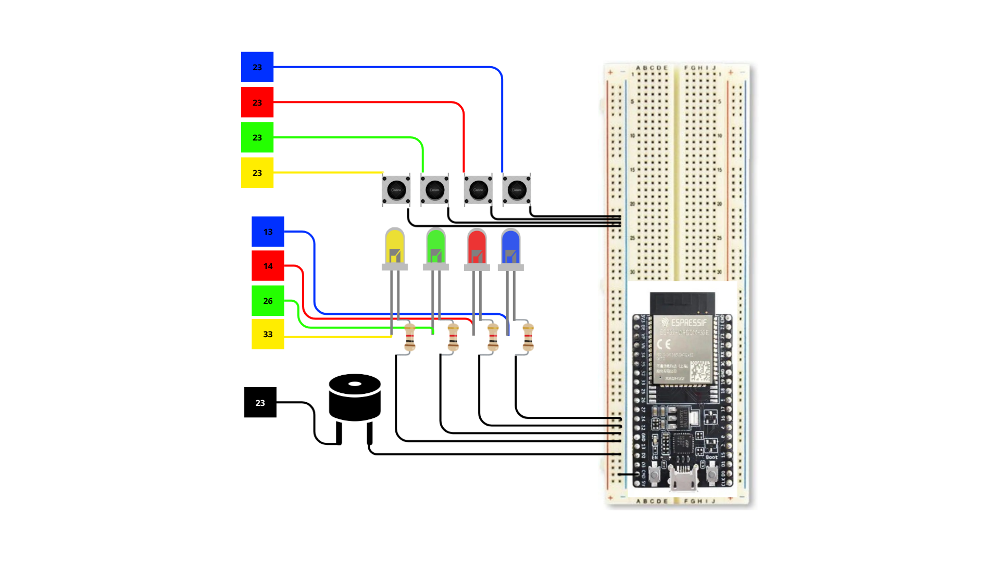

# Documentação Técnica Completa: Jogo da Memória "Gênius" - ESP32

**Autores:** Felipe Torres Marinho Barros e Arthur Franco Mendes Gomes  
**Projeto:** Sistema Embarcado Lúdico com ESP32 (LAARC)

---

## 1. Introdução e Contextualização do Problema

O desenvolvimento de habilidades cognitivas, como memória de curto prazo, foco e reflexo rápido, é um desafio constante em um mundo repleto de estímulos dispersos. No âmbito educacional e de entretenimento, há uma demanda contínua por ferramentas que unam o aprendizado prático de eletrônica e programação ao desenvolvimento dessas capacidades de forma lúdica.

O problema central deste projeto consiste em projetar e construir um sistema embarcado de baixo custo, intuitivo e interativo, capaz de desafiar e exercitar a memória sequencial do usuário por meio de estímulos visuais e sonoros coordenados.

---

## 2. A Solução Proposta

A solução desenvolvida é uma versão física e microcontrolada do clássico jogo "Gênius" (conhecido internacionalmente como *Simon*). O sistema utiliza o poder de processamento do microcontrolador **ESP32** montado em uma protoboard para criar um jogo de memorização ativa.

O dispositivo gera sequências aleatórias de cores e sons que aumentam de tamanho progressivamente à medida que o jogador acerta, exigindo que o usuário reproduza exatamente a mesma ordem utilizando os botões físicos correspondentes.

---

## 3. Requisitos do Sistema

### Requisitos Funcionais (O que o sistema faz)

* **Geração de Sequência:** O sistema inicia gerando uma cor/som aleatório e aumenta a sequência em um elemento a cada rodada de acerto.
* **Feedback Visual:** Cada cor gerada acende o LED correspondente (Verde, Vermelho, Amarelo ou Azul) por um intervalo de tempo padrão (500 ms).
* **Feedback Sonoro:** O acionamento de cada LED é acompanhado por uma frequência de som exclusiva emitida pelo buzzer, criando uma assinatura sonora distinta para cada cor (notas Dó, Mi, Sol, Dó alto).
* **Entrada do Usuário:** O sistema aguarda a resposta do jogador por meio de quatro botões de pressão (*push-buttons*).
* **Validação de Jogada:** O sistema compara em tempo real a entrada do usuário com a sequência armazenada na memória.
* **Indicação de Vitória/Derrota:** Há um padrão luminoso e sonoro específico para indicar o acerto da sequência completa (avanço de nível) ou o erro (animação de fim de jogo com pisca-pisca geral e som grave).

### Requisitos Não-Funcionais (Como o sistema se comporta)

* **Tempo de Resposta:** A detecção do pressionamento dos botões é imediata, utilizando travamento em laço `while` para evitar múltiplos disparos indesejados (*debounce* mecânico).
* **Eficiência de Processamento:** O código é estruturado de forma legível e otimizada para rodar de maneira fluida no ESP32 sem sobrecarregar a CPU.
* **Baixo Custo:** O circuito utiliza componentes eletrônicos básicos, acessíveis e reutilizáveis.

---

## 4. Lista Detalhada de Componentes Necessários

Para a montagem física do circuito, foram especificados os seguintes componentes eletrônicos e materiais de apoio:

| Item | Componente | Qtd. | Especificação Técnica | Função Detalhada no Circuito |
| :---: | :--- | :---: | :--- | :--- |
| **1** | **ESP32 DevKit v1** | 1 | Microcontrolador 32-bits, 240MHz, 30 pino GPIOs | Cérebro do sistema: processa a lógica do jogo, lê os botões e controla os LEDs e Buzzer. |
| **2** | **Protoboard (Breadboard)** | 1 | 830 pontos com barramentos de alimentação | Base para montagem do circuito sem necessidade de solda. |
| **3** | **LED Difuso 5mm Verde** | 1 | Tensão de operação: ~2.0V, Corrente: 20mA | Indicador luminoso da cor Verde (Tom Dó / 262 Hz). |
| **4** | **LED Difuso 5mm Vermelho** | 1 | Tensão de operação: ~2.0V, Corrente: 20mA | Indicador luminoso da cor Vermelha (Tom Mi / 330 Hz). |
| **5** | **LED Difuso 5mm Amarelo** | 1 | Tensão de operação: ~2.0V, Corrente: 20mA | Indicador luminoso da cor Amarela (Tom Sol / 392 Hz). |
| **6** | **LED Difuso 5mm Azul** | 1 | Tensão de operação: ~3.0V, Corrente: 20mA | Indicador luminoso da cor Azul (Tom Dó Alto / 523 Hz). |
| **7** | **Resistores de Limitação** | 4 | 220 Ω (ou 330 Ω), 1/4W, Tolerância 5% | Conectados em série com os LEDs para limitar a corrente das GPIOs do ESP32. |
| **8** | **Push-buttons (4 pinos)** | 4 | Chave táctil 6x6x5mm | Entradas digitais do usuário. Operam em modo `INPUT_PULLUP` (acionam em **LOW**). |
| **9** | **Buzzer Passivo** | 1 | Piezoelétrico, 5V, opera via sinal PWM (`tone()`) | Gerador de áudio. Reproduz notas musicais ajustando a frequência enviada pelo pino. |
| **10**| **Cabos Jumper** | ~20 | Macho-Macho / Macho-Fêmea | Realizam as conexões elétricas entre os componentes e as portas do ESP32. |
| **11**| **Cabo Micro-USB / USB-C** | 1 | Comunicação de dados e alimentação 5V | Conecta o ESP32 ao computador para gravação do firmware e energia. |

---

## 5. Mapeamento de Pinos e Esquema do Circuito (Hardware)

### Diagrama do Circuito



> **Nota de Validação Técnica:** Na ilustração gráfica do diagrama acima, alguns rótulos visuais de pinagem foram simplificados conceitualmente. Para a **montagem prática e compilação do software**, adote rigorosamente o mapeamento de pinos da tabela oficial abaixo.

### Tabela Oficial de Conexões dos Pinos (GPIOs)

| Cor / Canal | Pino LED (Saída) | Resistor do LED | Pino Botão (Entrada) | Modo do Pino | Frequência (Tom) | Nota Musical |
| :---: | :---: | :---: | :---: | :---: | :---: | :---: |
| **Verde** | GPIO 26 | 220 Ω -> GND | GPIO 25 | `INPUT_PULLUP` | 262 Hz | Dó (C4) |
| **Vermelho** | GPIO 14 | 220 Ω -> GND | GPIO 27 | `INPUT_PULLUP` | 330 Hz | Mi (E4) |
| **Amarelo** | GPIO 33 | 220 Ω -> GND | GPIO 32 | `INPUT_PULLUP` | 392 Hz | Sol (G4) |
| **Azul** | GPIO 13 | 220 Ω -> GND | GPIO 12 | `INPUT_PULLUP` | 523 Hz | Dó Alto (C5) |
| **Buzzer** | GPIO 23 | N/A (GND direto) | - | `OUTPUT` | Variável | Multi-tom |
| **Ruído Aleatório**| - | Solto (Sem conexão) | GPIO 34 | `ANALOG` | N/A | Seed para `random()` |

### Arquitetura de Ligação Elétrica:
1. **LEDs:** O anodo (perna longa) conecta-se à porta GPIO atribuída (26, 14, 33 ou 13). O catodo (perna curta) conecta-se a um resistor de 220 Ω, que vai ligado ao barramento **GND** (Terra).
2. **Botões:** Um terminal do botão conecta-se diretamente à porta GPIO atribuída (25, 27, 32 ou 12). O outro terminal conecta-se ao **GND**. Graças ao modo `INPUT_PULLUP`, quando o botão está solto a porta lê `HIGH`; quando pressionado, lê `LOW`.
3. **Buzzer:** O pino positivo (+) conecta-se na **GPIO 23** e o negativo (-) no barramento **GND**.

---

## 6. Arquitetura do Sistema e Máquina de Estados Finitos (FSM)

O comportamento do jogo é modelado através de uma **Máquina de Estados Finitos (FSM)** composta por 5 estados fundamentais:

```text
               +-------------------+
               |  1. ESTADO_INIT   |
               | (Config / Vinheta)|
               +---------+---------+
                         |
                         v
               +-------------------+
               | 2. MOSTRAR_SEQ    | <-------------------+
               | (ESP32 Pisca/Toca)|                     |
               +---------+---------+                     |
                         |                               |
                         v                               |
               +-------------------+                     |
               | 3. AGUARDAR_JOGADA|                     |
               | (Leitura Botões)  |                     |
               +---------+---------+                     |
                         |                               |
                    [Validar]                            |
                     /     \                             |
               (Correto)  (Incorreto)                    |
                  /           \                          |
                 v             v                         |
       +---------------+  +-------------------+          |
       | 4. PROX_NIVEL |  | 5. GAME_OVER      |          |
       | (Nivel++ /    |  | (Animação Erro /  |          |
       |  Nova Cor)    |  |  Reset p/ Nivel 1)|          |
       +-------+-------+  +---------+---------+          |
               |                    |                    |
               +--------------------+--------------------+
